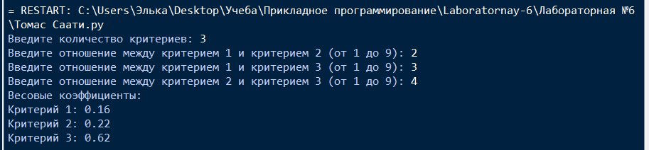
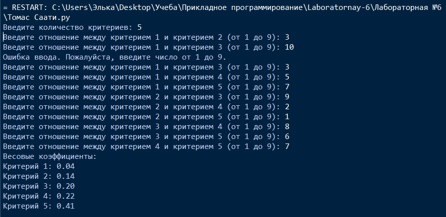
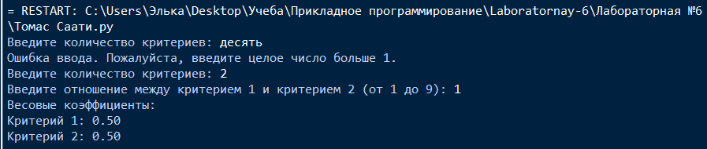

# Лабораторная №6

# Исполнитель
Громова Эльвира  
Группа ФТ-220007

# Задание
Написать программу, реализующую метод анализа иерархий Томаса Саати для одного уровня.

Входные данные: количество критериев, данные попарного сравнения критериев (запрашивать попарно).  
Выходные данные: весовые коэффициенты в виде 0.00
Задание * - Разработать графический интерфейс

Обеспечить достаточный уровень качества ПО:   
Код программы должен содержать комментарии для созданных функций и основных блоков (но пишем не «что» сделано, а «зачем»).  
Качественный диалог с пользователем и обработку ошибок ввода (для минимизации отказов при неправильном вводе).

# Среда разработки
Язык программирования: Python  
Среда разработки: IDLE

# Инструкция по работе
При открытии файла Томас Саати.py необходимо ввести количество критериев, и отношения между критериями.

Запустить программу, нажав ENTER. При выводе Вы увидите весовые коэффициенты.

# Тесты
Выполнение программы  

Тест №1

Тест №2 (Проверка ошибки для ввода отношения критериев)

Тест №3 (Проверка ошибки для ввода количества критериев)

